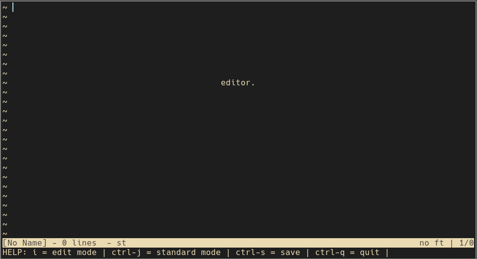

# EDITOR

This is an editor written in under 2000 lines of C code with *plenty* of comments.
It was made as a learning exercise to be as close to a hard-code version of my vimrc as possible.

## Features
TODO

## Install
TODO

This editor is written in C originally based on the excellent tutorial by snaptoken called 
"Build Your Own Text Editor", which can be found [here](https://viewsourcecode.org/snaptoken/kilo/index.html)

