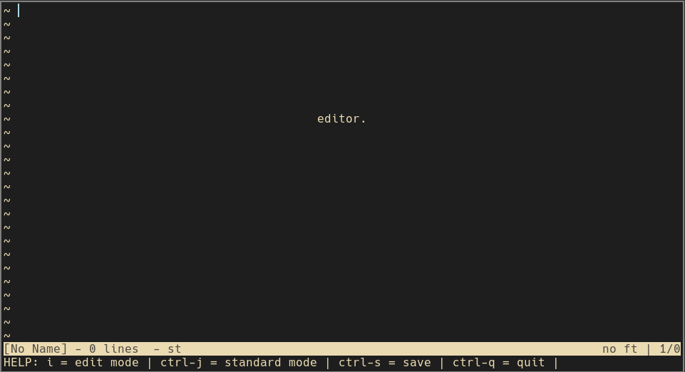

# EDITOR

This is an editor written in under 2000 lines of C code with *plenty* of comments.
It was made as a learning exercise to be as close to a hard-coded version of my vimrc as possible.

## Features

* Insert (edit) and normal (standard) modes 
* Search your text files with `ctrl-f`
* Write to files with `ctrl-s`
* Press `ctrl-q` three times to exit without saving

## Differences between editor and Kilo 
* (Some) Vim binding support (supports HJKL / visual mode)
* Visual differences (changed mode titles and increased spacing) 

## Install
Requires GCC and Make on linux or MacOS.

Run make.

Then use ./editor to run.
Use ./editor example.txt to open the file example.txt

This editor is written in C originally based on the excellent tutorial by snaptoken called 
"Build Your Own Text Editor", which can be found [here](https://viewsourcecode.org/snaptoken/kilo/index.html)

